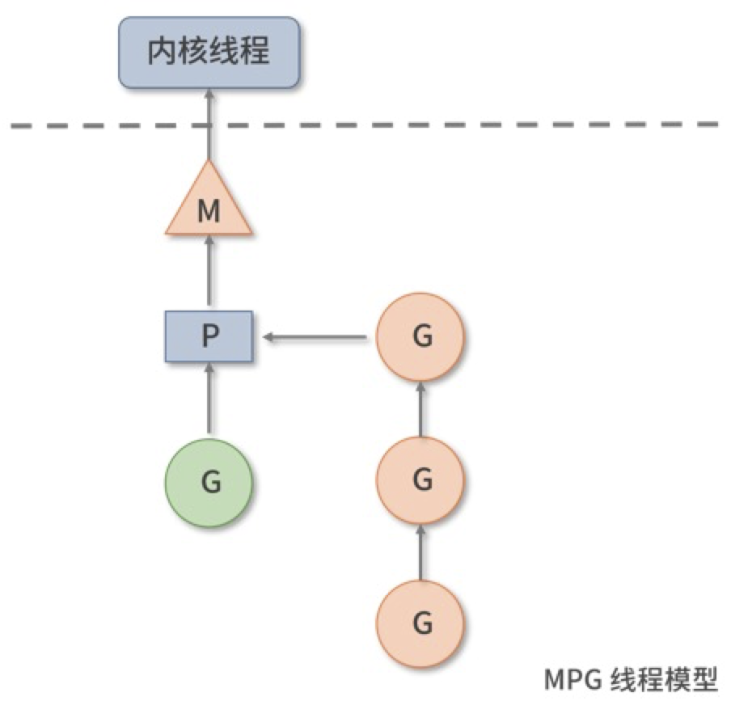
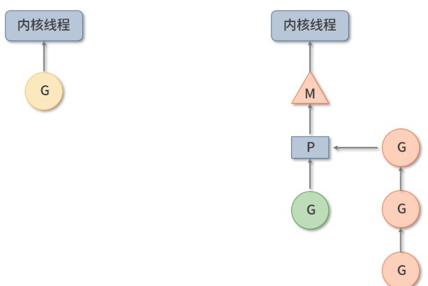

# go 并发相关知识

####1 协程  
**一种用户线程，轻量级线程**   
协程的调度由用户空间的代码控制；  
有自己的寄存器上下文+栈，存储在用户空间；  
协程切换无须切换到内核态访问内核空间，切换速度极快  
go的MPG模型如下图  
M：machine 相当于内核线程在Go的映射  
P：processor Go代码执行所需的上下文 P决定Go的并发规模，runtime.GOMAXPROCS决定  
G：Goroutine 轻量级线程，对代码片段对封装，拥有执行时的栈、状态、代码片段等信息
  

实际执行的时候M和P共同为G提供运行环境 如下
  
多个可执行的 G 顺序挂载在 P 的可执行 G 队列下面，等待调度和执行。当 G 中存在一些 I/O 系统调用阻塞了 M 时，P 将会断开与 M 的联系，从调度器空闲 M 队列中获取一个 M 或者创建一个新的 M 组合执行， 保证 P 中可执行 G 队列中其他 G 得到执行，且由于程序中并行执行的 M 数量没变，保证了程序 CPU 的高利用率  

当 G 中系统调用执行结束返回时，M 会为 G 捕获一个 P 上下文，如果捕获失败，就把 G 放到全局可执行 G 队列等待其他 P 的获取。  
新创建的 G 会被放置到全局可执行 G 队列中，等待调度器分发到合适的 P 的可执行 G 队列中。M 和 P 结合后，会从 P 的可执行 G 队列中无锁获取 G 执行。当 P 的可执行 G 队列为空时，P 才会加锁从全局可执行 G 队列获取 G。当全局可执行 G 队列中也没有 G 时，P 会尝试从其他 P 的可执行 G 队列中“剽窃” G 执行。

Go通过goroutine + channel 实现CSP并发模型  
~~~~
go xxx   #并发执行
~~~~  
channel 是一种引用类型，声明时需要指定传输类型
~~~~
var name chan T  // 双向channel
var name chan <- T  // 只能发送消息的channel
var name T <- chan  // 只能接受消息的channel
~~~~

basepractice/GoConcurrencyTest.go 生产者消费者示例

注意 main函数执行结束，整个GO也会结束 无论是否有未执行完的goruntine  

## select 多路复用
需要从多个channel 接受消息时，go的 select关键字可以提供类似多路复用能力  
使得goruntine可以同时等待多个channel的读写操作
